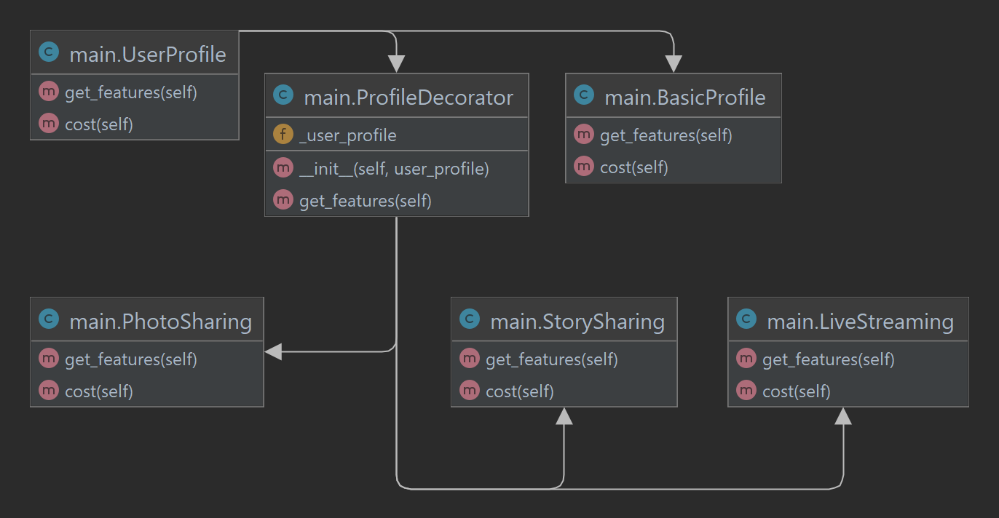

# Decorator Pattern: Theory and Application in Python

## 1. Introduction
In modern software engineering, design patterns play a key role in building flexible and extensible systems. One of these structural patterns is the Decorator Pattern, which allows new responsibilities to be added to objects dynamically without altering their basic structure. This is achieved by using composition instead of inheritance, providing greater flexibility in extending the functionality of objects at runtime.

The Decorator Pattern, also known as the "Wrapper," offers the following advantages:
- **Flexibility**: Allows responsibilities to be added dynamically to objects without affecting other objects of the same class.
- **Extensibility**: Simplifies functionality extension by creating new classes rather than modifying existing ones.
- **Code Simplicity**: Enables building a sequence of functionalities through combining decorators rather than implementing all behaviors in a single object.

## 2. Theoretical Framework
### 2.1. Key Components of the Decorator Pattern
The Decorator Pattern consists of the following key elements:
- **Component**: An abstract class or interface that defines the common interface for objects that can be decorated.
- **Concrete Component**: A class that implements the component interface and represents the object to be decorated.
- **Decorator**: An abstract class or interface that also implements the component interface and contains a reference to an object of the component type. It serves as a base class for all concrete decorators.
- **Concrete Decorator**: A class that inherits from the decorator and adds specific functionality to the component.

### 2.2. Working Mechanism
The Decorator Pattern uses composition instead of inheritance to extend the functionality of objects. Instead of creating multiple subclasses for every possible combination of features, we can create different decorators that dynamically add desired responsibilities to the object at runtime. This provides greater flexibility and reduces the complexity of the class hierarchy.

### 2.3. Advantages of the Decorator Pattern
- **Flexibility**: Allows dynamic addition or removal of functionalities to objects at runtime without affecting other objects of the same class.
- **Extensibility**: Facilitates the extension of functionality by creating new decorators without modifying existing classes.
- **Transparency**: Decorators can be combined in various ways, allowing the creation of complex objects with diverse functionalities without disrupting the core structure of the object.

### 2.4. Disadvantages of the Decorator Pattern
- **Code Complexity**: Multiple decorators can lead to more complex and harder-to-track code, especially if misused.
- **Debugging Difficulty**: Due to the multiple layers of decorators, tracking errors can be more challenging.

### 2.5. When to Use the Decorator Pattern
The Decorator Pattern is especially useful in the following cases:
- **Dynamic addition of responsibilities to objects**: For example, in graphical user interfaces where different visual components can be decorated with additional effects like borders, shadows, etc.
- **When inheritance is impractical**: In situations where creating multiple subclasses for each combination of functionalities would lead to a class explosion and complicate the hierarchy.
- **To adhere to the Open/Closed Principle**: This principle states that classes should be open for extension but closed for modification. The Decorator Pattern allows extending functionality without modifying existing code.

### 2.6. Real-World Examples
The Decorator Pattern finds application in various areas in the real world:
- **Stream input-output systems**: In many programming languages, like Java and .NET, stream I/O systems use decorators to add functionalities like buffering, compression, and encryption to basic streams.
- **Graphical user interfaces**: In graphical libraries where visual components can be decorated with various visual effects without altering the core component.
- **Logging systems**: In software systems where logging can be added to different components via decorators without changing their core functionality.

## 3. UML Class Structure Diagram


## 4. Project Description and Classes

This project demonstrates the application of the Decorator Pattern to dynamically extend the functionality of user profiles in a social network. The main idea is to create a basic profile with core features and, through decorators, add additional functionalities such as photo sharing, story sharing, and live streaming.

### 4.1. Defining an Abstract Class for User Profiles

We start by defining an abstract class UserProfile, which contains two abstract methods:
- get_features(): Returns a list of the profile's features.
- cost(): Returns the cost of the profile.

```py
from abc import ABC, abstractmethod

# Abstract class for user profile
class UserProfile(ABC):
    @abstractmethod
    def get_features(self):
        pass

    @abstractmethod
    def cost(self):
        pass
```
### 4.2. Creating a Basic Profile with Core Features

After defining the abstract class, we create the `BasicProfile` class, which inherits from `UserProfile` and implements the basic functionalities of a profile:
```py
class BasicProfile(UserProfile):
    def get_features(self):
        return "Basic Profile Features: Text Posts, Comments, Likes"
    
    def cost(self):
        return 0  # Free basic profile
```
### 4.3. Defining an Abstract Decorator

We define an abstract class ProfileDecorator, which also inherits from UserProfile and serves as the base class for all concrete decorators. It accepts an object of type UserProfile and stores it in _user_profile:

```py
# Abstract decorator
class ProfileDecorator(UserProfile):
    def __init__(self, user_profile):
        self._user_profile = user_profile

    @abstractmethod
    def get_features(self):
        pass
```
### 4.4. Creating Concrete Decorators

We create three concrete decorators that add new features to the profile:

#### PhotoSharing
The `PhotoSharing` decorator adds the photo-sharing feature to the profile and increases the cost by 5 currency units.

- Decorator for adding photo sharing functionality
```py
class PhotoSharing(ProfileDecorator):
    def get_features(self):
        return self._user_profile.get_features() + ", Photo Sharing"
    
    def cost(self):
        return self._user_profile.cost() + 5  # Additional cost for photo sharing
```
#### StorySharing
The `StorySharing` decorator adds the story-sharing feature to the profile and increases the cost by 3 currency units.


- Decorator for adding story sharing functionality
```py
class StorySharing(ProfileDecorator):
    def get_features(self):
        return self._user_profile.get_features() + ", Story Sharing"
    
    def cost(self):
        return self._user_profile.cost() + 3  # Additional cost for story sharing
```
#### LiveStreaming
The `LiveStreaming` decorator adds the live streaming feature to the profile and increases the cost by 10 currency units.

- Decorator for adding live streaming functionality
```py
class LiveStreaming(ProfileDecorator):
    def get_features(self):
        return self._user_profile.get_features() + ", Live Streaming"
    
    def cost(self):
        return self._user_profile.cost() + 10  # Additional cost for live streaming
```
### 4.5. Demonstration of Using the Decorators

Now, we will create a basic profile and extend it with several profiles using the decorators we have defined.

```py
if __name__ == "__main__":
    # Create a basic profile
    basic_profile = BasicProfile()
    print("{} - Cost: ${}".format(basic_profile.get_features(), basic_profile.cost()))
    
    # Add photo sharing feature
    photo_profile = PhotoSharing(basic_profile)
    print("{} - Cost: ${}".format(photo_profile.get_features(), photo_profile.cost()))
    
    # Add story sharing feature to the profile
    story_profile = StorySharing(photo_profile)
    print("{} - Cost: ${}".format(story_profile.get_features(), story_profile.cost()))
    
    # Full profile with all features
    full_profile = LiveStreaming(StorySharing(PhotoSharing(basic_profile)))
    print("{} - Cost: ${}".format(full_profile.get_features(), full_profile.cost()))
```

This example demonstrates how, with the help of the Decorator Pattern, we can flexibly extend the functionality of objects without changing their core structure. This approach is especially useful in systems like social networks, where users can select different combinations of features according to their needs.

### 5. Conclusion

In this project, we explored the application of the Decorator Pattern to dynamically extend the functionality of user profiles in a social network. By using this pattern, we were able to add new features such as photo sharing, story sharing, and live streaming without modifying the core structure of the base profile.

The main advantages of the Decorator Pattern highlighted in this project include:
- **Flexibility**: The ability to add or remove functionalities at runtime, making it easier to adapt to changing user requirements.
- **Code Reusability**: By creating separate decorators for each functionality, the code becomes more modular and easier to maintain.
- **Compliance with the Open/Closed Principle**: The system remains open to extension through new decorators, while closed to modifications of existing classes.

Despite these advantages, it should be noted that excessive use of decorators can lead to increased code complexity and debugging difficulties. Therefore, it is essential to apply this pattern judiciously and only when truly necessary.

### 6. References

- Gamma, E., Helm, R., Johnson, R., & Vlissides, J. (1994). *Design Patterns: Elements of Reusable Object-Oriented Software*. Addison-Wesley.
- Freeman, E., & Robson, E. (2004). *Head First Design Patterns*. O'Reilly Media.
- Refactoring.Guru: [Decorator Pattern](https://refactoring.guru/design-patterns/decorator)
- GeeksforGeeks: [Decorator Design Pattern in Java with Example](https://www.geeksforgeeks.org/decorator-design-pattern-in-java-with-example/)
- Baeldung: [The Decorator Pattern in Java](https://www.baeldung.com/java-decorator-pattern)

### 7. Execution Result

```plaintext
Basic Profile Features: Text Posts, Comments, Likes - Cost: $0
Basic Profile Features: Text Posts, Comments, Likes, Photo Sharing - Cost: $5
Basic Profile Features: Text Posts, Comments, Likes, Photo Sharing, Story Sharing - Cost: $8
Basic Profile Features: Text Posts, Comments, Likes, Photo Sharing, Story Sharing, Live Streaming - Cost: $18

